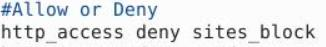
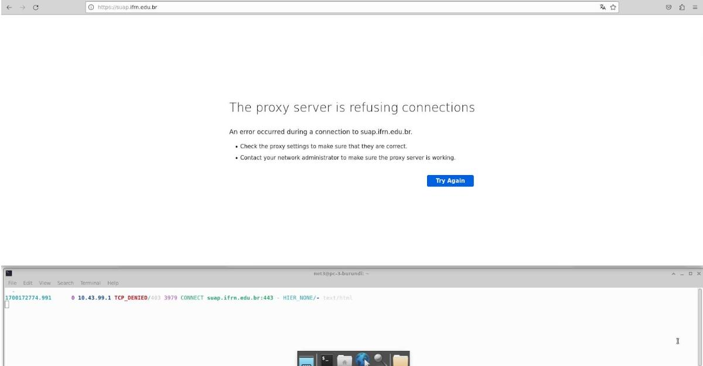

# PROXY

## Instalação

Para instalar o squid no linux utilizamos o comando padrão (Baseados no Debian)

    apt install squid

Durante a instalação será criado várias arquivos e diretórios, entre eles:

 - debian.conf (O nome varia dependendo da distro)

 - access.log

## Configuração

**OBS:** Por padrão o squid nega todo o acesso quando é instalado, para desabilitar vá em:

- /etc/squid/squid.conf

Proucure a linha que tem _http_access **deny** all_ e troque para **allow** isso vai permitir o acesso para todos os site, desse jeito:

 o padrão de construção é:

-     acl NOME_DA_ACL TIPO_DA_ACL parâmetro

    EX: acl exemplo dst www.facebook.com

Existe vários (TIPO_DA_ACL)

-   dst = O parâmetro sera um host,rede ou domínio ex: www.youtube.com

-   url_regex = O parâmetro sera um nome ou palavras 

-   port = O parâmetro sera uma porta ex: 80

-   Para ver mais entre em (ACLS Squid)

O arquivo por padrão vem assim:

Aqui alguns exemplos de acls criadas:

Neste exemplo uma das acls é *'sites_block'*. É para bloquear ou permitir o site o padrão de construção é:

    -   http_access permissão NOME_DA_ACL

Tipos de permissão 

    deny: Nega o acesso                 

    allow: Permiti o acesso

* **NOME_DA_ACL:** Nesse caso foi usado sites_block

O exemplo ficará assim:

Agora e só ir no navegador e configura o proxy, por padrão: 

1.Abra o navegador.

2.No menu, selecione Configurações ou Opções.

3.Na seção Rede, selecione Configurações de proxy.

4.Marque a caixa Usar um servidor proxy.

5.Insira o endereço IP do servidor proxy e a porta.

(Pode variar entres os navegadores)

Incluir o(s) nome(s) e o conteúdo do(s) arquivo(s) de configuração.

Fazer a configuração de 4 ACLs distintas, conforme a atividade passada em sala de aula.

## Teste

 
